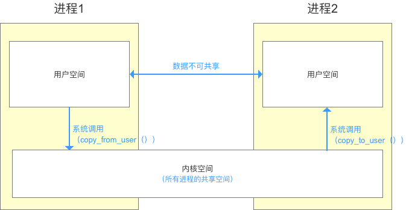
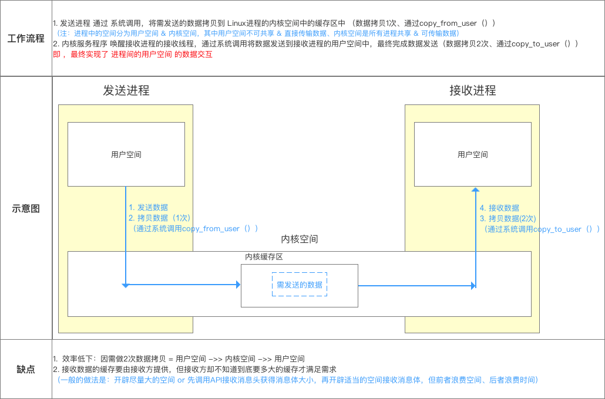
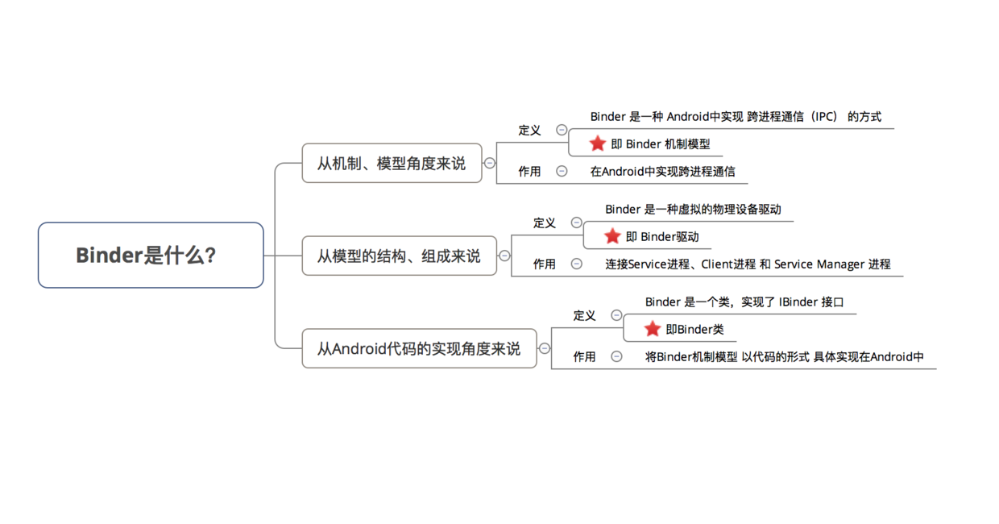
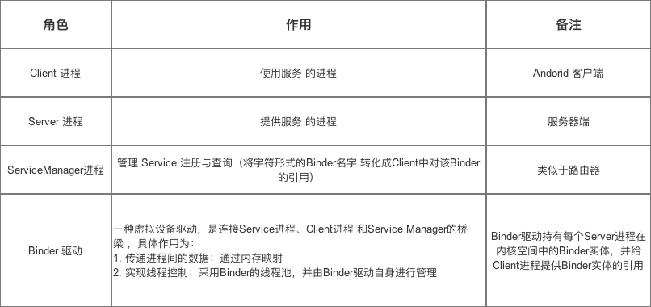
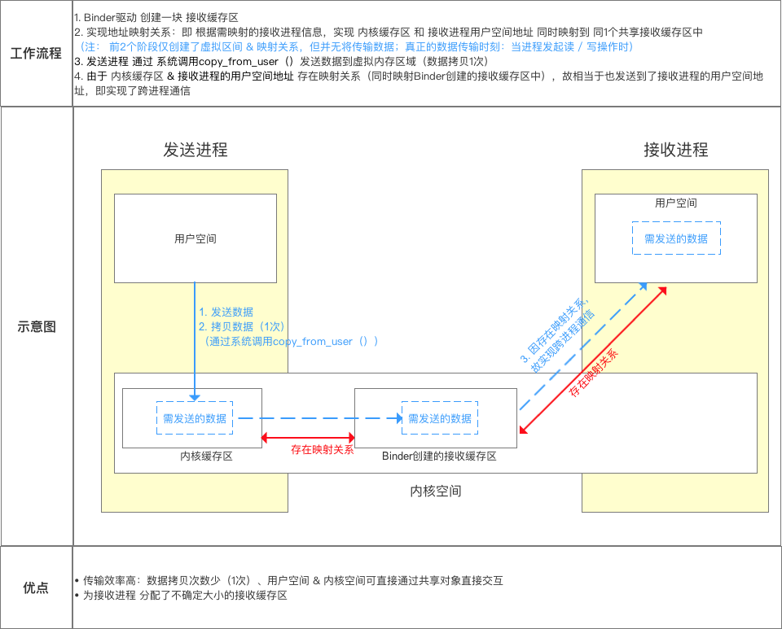
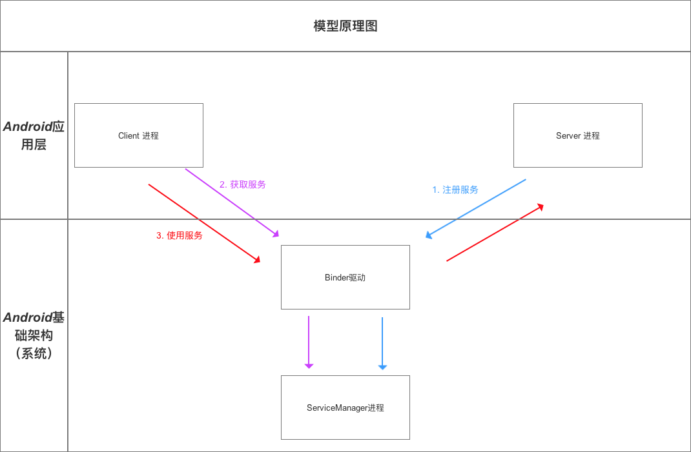
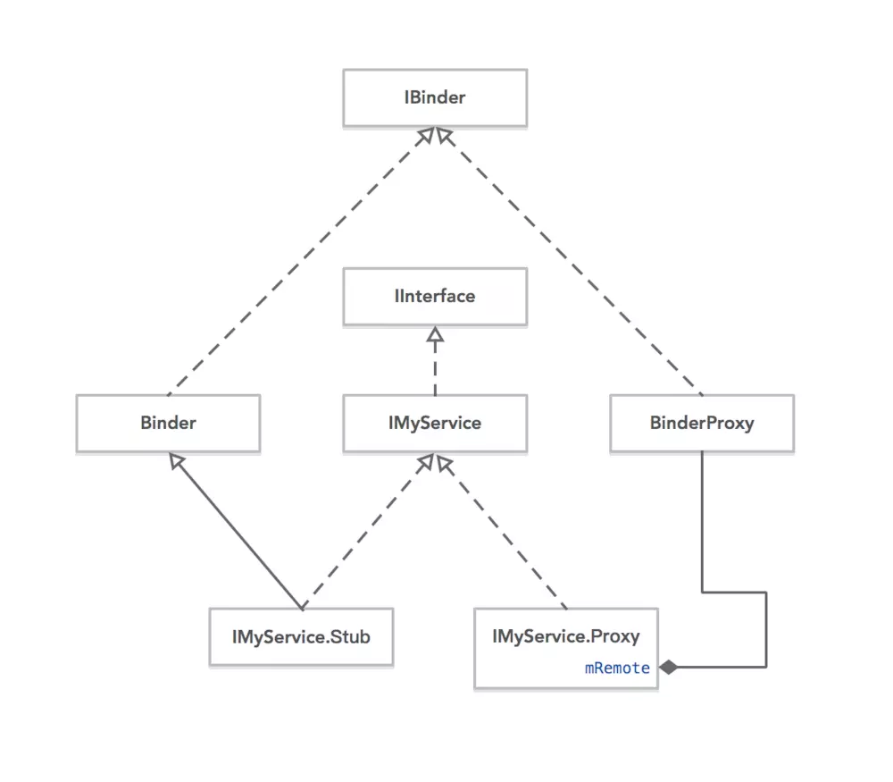

### 知识储备
#### Linux进程空间划分
* 一个进程空间分为 用户空间 & 内核空间（Kernel），即把进程内 用户 & 内核 隔离开来
* 二者区别： 
* 进程间，用户空间的数据不可共享，所以用户空间 = 不可共享空间
* 进程间，内核空间的数据可共享，所以内核空间 = 可共享空间 

> 所有进程共用1个内核空间

* 进程内 用户空间 & 内核空间 进行交互 需通过 系统调用，主要通过函数：
> 1. copy_from_user（）：将用户空间的数据拷贝到内核空间
> 2. copy_to_user（）：将内核空间的数据拷贝到用户空间

 

#### 进程隔离 & 跨进程通信（ IPC ）
* 进程隔离 
* 为了保证 安全性 & 独立性，一个进程 不能直接操作或者访问另一个进程，即Android的进程是相互独立、隔离的

* 跨进程通信（ IPC ） 
* 即进程间需进行数据交互、通信

* 跨进程通信的基本原理

 

#### 内存映射mmap
mmap是一种内存映射文件的方法，即将一个文件或者其它对象映射到进程的地址空间，实现文件磁盘地址和进程虚拟地址空间中一段虚拟地址的一一对映关系。实现这样的映射关系后，进程就可以采用指针的方式读写操作这一段内存，而系统会自动回写脏页面到对应的文件磁盘上，即完成了对文件的操作而不必再调用read,write等系统调用函数。相反，内核空间对这段区域的修改也直接反映用户空间，从而可以实现不同进程间的文件共享

### Binder到底是什么？
* 中文即 粘合剂，意思为粘合了两个不同的进程
* 需要从不同的角度去看

 

#### Binder 跨进程通信机制 模型
* Binder 跨进程通信机制 模型 基于 Client - Server 模式 

 

#### 模型组成角色说明

 

* 此处重点讲解 Binder驱动的作用 & 原理：

 

* 跨进程通信的核心原理 

 

#### 模型原理步骤说明

 

#### 注意

说明1：Client进程、Server进程 & Service Manager 进程之间的交互 都必须通过Binder驱动（使用 open 和 ioctl文件操作函数），而非直接交互
原因： 
1. Client进程、Server进程 & Service Manager进程属于进程空间的用户空间，不可进行进程间交互 
2. Binder驱动 属于 进程空间的 内核空间，可进行进程间 & 进程内交互

所以，原理图可表示为以下：

> 虚线表示并非直接交互

 

说明2： Binder驱动 & Service Manager进程 属于 Android基础架构（即系统已经实现好了）；而Client 进程 和 Server 进程 属于Android应用层（需要开发者自己实现）
所以，在进行跨进程通信时，开发者只需自定义Client & Server 进程 并 显式使用上述3个步骤，最终借助 Android的基本架构功能就可完成进程间通信

 

说明3：Binder请求的线程管理
Server进程会创建很多线程来处理Binder请求
Binder模型的线程管理 采用Binder驱动的线程池，并由Binder驱动自身进行管理 
> 而不是由Server进程来管理的

一个进程的Binder线程数默认最大是16，超过的请求会被阻塞等待空闲的Binder线程。

> 所以，在进程间通信时处理并发问题时，如使用ContentProvider时，它的CRUD（创建、检索、更新和删除）方法只能同时有16个线程同时工作

### Binder机制 在Android中的具体实现原理

 

AIDL 生成的就是 IMyService 这个接口，而 Stub 和 Proxy 则是这个接口的两个内部类，分别是 Binder 类和 BinderProxy 类的子类（Proxy 类虽然是用组合方式来持有 BinderProxy 的，但实际就是在直接用这个类，只不过做了一层封装，让其更易使用而已），Stub 和 Proxy 都实现了 IMyService。
所以 IInterface 到底是什么，它就是一个用于表达 Service 提供的功能的一个契约，也就是说 IInterface 里有的方法，Service 都能提供，调用者你别管用的是 BinderProxy 还是什么，只要拿到 IInterface，你就可以直接调用里面的方法，它就是一个接口。
同时 Stub 虽然实现了 IMyService，但是并没有实现厘米的任何方法，它是一个抽象类，开发者需要自己子类化 Stub 去实现具体的功能。
Proxy 实现了 IMyService，并且实现了里面的方法，这些方法的实现我们下面再说。
为什么 IMyService 要分 Stub 和 Proxy 呢？这是为了要适用于本地调用和远程调用两种情况。如果 Service 运行在同一个进程，那就直接用 Stub，因为它直接实现了 Service 提供的功能，不需要任何 IPC 过程。如果 Service 运行在其他进程，那客户端使用的就是 Proxy，这里这个 Proxy 的功能大家应该能想到了吧，就是把参数封装后发送给 Binder 驱动，然后执行一系列 IPC 操作最后再取出结果返回。
好，到这里请求用 Proxy 发出去了，Service 怎么接受请求并作出响应呢，这就需要 Stub 了，还记得我们的 Stub 是继承自 Binder 的吗？Binder 有一个 onTransact 方法，而 Stub 重写了这个函数，这个函数三个重要参数：int code、Parcel data、Parcel reply，分别对应了被调函数编号、参数包、响应包。当 Proxy 发起了一个请求，服务端中相应的响应线程就会通过 JNI 调用到 Stub 类，然后执行里面的 execTransact 方法，进而转到 onTransact 方法。（这一系列调用链大家可以从源码中分析出来，我这里作为抛砖引玉，就不带大家分析 native 层的代码了）

### 为什么必须理解 Binder ？
作为 Android 工程师的你，是不是常常会有这样的疑问：

为什么 Activity 间传递对象需要序列化？
Activity 的启动流程是什么样的？
四大组件底层的通信机制是怎样的？
AIDL 内部的实现原理是什么？
插件化编程技术应该从何学起？等等...
这些问题的背后都与 Binder 有莫大的关系，要弄懂上面这些问题理解 Bidner 通信机制是必须的。

我们知道 Android 应用程序是由 Activity、Service、Broadcast Receiver 和 Content Provide 四大组件中的一个或者多个组成的。有时这些组件运行在同一进程，有时运行在不同的进程。这些进程间的通信就依赖于 Binder IPC 机制。不仅如此，Android 系统对应用层提供的各种服务如：ActivityManagerService、PackageManagerService 等都是基于 Binder IPC 机制来实现的。Binder 机制在 Android 中的位置非常重要，毫不夸张的说理解 Binder 是迈向 Android 高级工程的第一步。

2.2 为什么是 Binder ?
Android 系统是基于 Linux 内核的，Linux 已经提供了管道、消息队列、共享内存和 Socket 等 IPC 机制。那为什么 Android 还要提供 Binder 来实现 IPC 呢？主要是基于性能、稳定性和安全性几方面的原因。

性能
首先说说性能上的优势。Socket 作为一款通用接口，其传输效率低，开销大，主要用在跨网络的进程间通信和本机上进程间的低速通信。消息队列和管道采用存储-转发方式，即数据先从发送方缓存区拷贝到内核开辟的缓存区中，然后再从内核缓存区拷贝到接收方缓存区，至少有两次拷贝过程。共享内存虽然无需拷贝，但控制复杂，难以使用。Binder 只需要一次数据拷贝，性能上仅次于共享内存。

 

注：各种IPC方式数据拷贝次数，此表来源于Android Binder 设计与实现 - 设计篇

稳定性
再说说稳定性，Binder 基于 C/S 架构，客户端（Client）有什么需求就丢给服务端（Server）去完成，架构清晰、职责明确又相互独立，自然稳定性更好。共享内存虽然无需拷贝，但是控制负责，难以使用。从稳定性的角度讲，Binder 机制是优于内存共享的。

安全性
另一方面就是安全性。Android 作为一个开放性的平台，市场上有各类海量的应用供用户选择安装，因此安全性对于 Android 平台而言极其重要。作为用户当然不希望我们下载的 APP 偷偷读取我的通信录，上传我的隐私数据，后台偷跑流量、消耗手机电量。传统的 IPC 没有任何安全措施，完全依赖上层协议来确保。首先传统的 IPC 接收方无法获得对方可靠的进程用户ID/进程ID（UID/PID），从而无法鉴别对方身份。Android 为每个安装好的 APP 分配了自己的 UID，故而进程的 UID 是鉴别进程身份的重要标志。传统的 IPC 只能由用户在数据包中填入 UID/PID，但这样不可靠，容易被恶意程序利用。可靠的身份标识只有由 IPC 机制在内核中添加。其次传统的 IPC 访问接入点是开放的，只要知道这些接入点的程序都可以和对端建立连接，不管怎样都无法阻止恶意程序通过猜测接收方地址获得连接。同时 Binder 既支持实名 Binder，又支持匿名 Binder，安全性高。

基于上述原因，Android 需要建立一套新的 IPC 机制来满足系统对稳定性、传输性能和安全性方面的要求，这就是 Binder。

最后用一张表格来总结下 Binder 的优势：

 

### Binder 通信中的代理模式
我们已经解释清楚 Client、Server 借助 Binder 驱动完成跨进程通信的实现机制了，但是还有个问题会让我们困惑。A 进程想要 B 进程中某个对象（object）是如何实现的呢？毕竟它们分属不同的进程，A 进程 没法直接使用 B 进程中的 object。

前面我们介绍过跨进程通信的过程都有 Binder 驱动的参与，因此在数据流经 Binder 驱动的时候驱动会对数据做一层转换。当 A 进程想要获取 B 进程中的 object 时，驱动并不会真的把 object 返回给 A，而是返回了一个跟 object 看起来一模一样的代理对象 objectProxy，这个 objectProxy 具有和 object 一摸一样的方法，但是这些方法并没有 B 进程中 object 对象那些方法的能力，这些方法只需要把把请求参数交给驱动即可。对于 A 进程来说和直接调用 object 中的方法是一样的。

当 Binder 驱动接收到 A 进程的消息后，发现这是个 objectProxy 就去查询自己维护的表单，一查发现这是 B 进程 object 的代理对象。于是就会去通知 B 进程调用 object 的方法，并要求 B 进程把返回结果发给自己。当驱动拿到 B 进程的返回结果后就会转发给 A 进程，一次通信就完成了。

5.4 Binder 的完整定义
现在我们可以对 Binder 做个更加全面的定义了：

从进程间通信的角度看，Binder 是一种进程间通信的机制；
从 Server 进程的角度看，Binder 指的是 Server 中的 Binder 实体对象；
从 Client 进程的角度看，Binder 指的是对 Binder 代理对象，是 Binder 实体对象的一个远程代理
从传输过程的角度看，Binder 是一个可以跨进程传输的对象；Binder 驱动会对这个跨越进程边界的对象对一点点特殊处理，自动完成代理对象和本地对象之间的转换。

